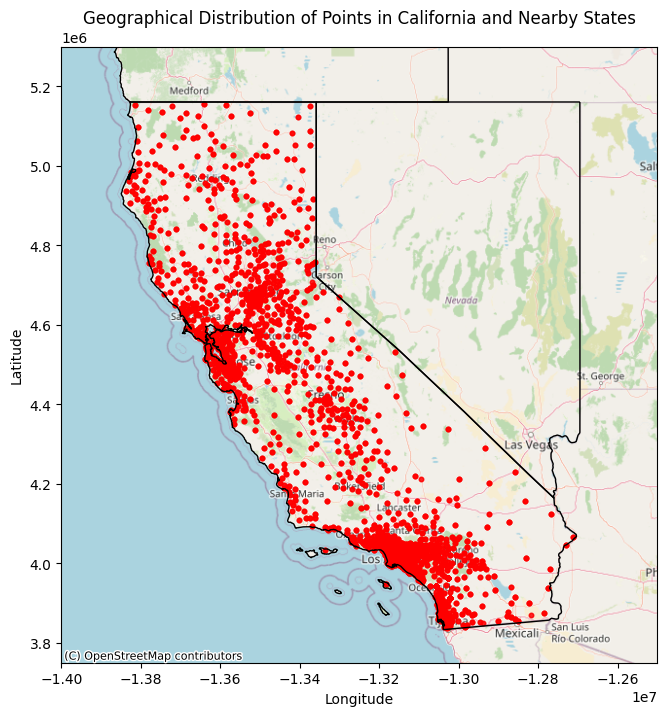

# Churn Prediction with SHAP

## Table of Contents
1. [Introduction](#introduction)
2. [Datasets](#datasets)
3. [Exploratory Data Analysis](#exploratory-data-analysis)
4. [Machine Learning](#machine-learning)
5. [Explainability with SHAP](#explainability-with-shap)
6. [Requirements](#requirements)

## Introduction

This project aims to build a robust model for predicting customer churn using the Telco Customer Dataset from IBM. Churn prediction is crucial for businesses to identify customers who are likely to leave, enabling them to take proactive measures to retain these customers. The focus of this project is not only on achieving accurate predictions but also on ensuring that these predictions are interpretable and actionable.

To achieve this, the project integrates the SHAP (SHapley Additive exPlanations) algorithm, a powerful tool for model explainability. SHAP provides both global and local explanations, helping data scientists and business stakeholders understand which factors contribute most to customer churn. This dual focus on prediction accuracy and explainability is essential in making the model’s insights both trustworthy and actionable for business decisions.

The analysis provides valuable insights into the risk factors for customer churn, guiding companies on where to focus their retention efforts. This combination of predictive modeling and explainability offers a comprehensive tool for businesses looking to reduce churn and improve customer loyalty.


## Datasets

These datasets were taken from [here](https://accelerator.ca.analytics.ibm.com/bi/?perspective=authoring&pathRef=.public_folders/IBM+Accelerator+Catalog/Content/DAT00148&id=i9710CF25EF75468D95FFFC7D57D45204&objRef=i9710CF25EF75468D95FFFC7D57D45204&action=run&format=HTML&cmPropStr=%7B%22id%22:%22i9710CF25EF75468D95FFFC7D57D45204%22,%22type%22:%22reportView%22,%22defaultName%22:%22DAT00148%22,%22permissions%22:%5B%22execute%22,%22read%22,%22traverse%22%5D%7D)

These are Telecommunications Industry Sample Data given by IBM. The Telco customer churn data contains information about a fictional telco company that provided home phone and Internet services to 7043 customers in California in Q3. It indicates which customers have left, stayed, or signed up for their service. Multiple important demographics are included for each customer, as well as a Satisfaction Score, Churn Score, and Customer Lifetime Value (CLTV) index.

I analyzed these datasets about:
* Demographics information
* Location information
* Population information
* Services information
* Status information
* a complete [dataset](Data/CustomerChurn.xlsx) about Customer Churn. This is the dataset I used to make prediction and explanations


## Exploratory Data Analysis

## Exploratory Data Analysis

In this project, I applied Object-Oriented Programming (OOP) principles by creating a custom `EDA` class [here](src/data_viz.py). This class encapsulates all the necessary methods for performing statistical analysis and data visualization across different datasets. The use of OOP provided several advantages:

- **Code Reusability**: By defining the `EDA` class, I was able to reuse the same code structure across various datasets, eliminating redundancy and ensuring consistency in the analysis process.
- **Scalability**: The class-based approach allowed me to easily extend and adapt the analysis to new datasets with minimal changes, making the code highly scalable.
- **Modularity**: The encapsulation of EDA functionalities within a class enhanced the modularity of the code, simplifying maintenance and future enhancements.

The results and insights obtained from the EDA are comprehensively documented within the [notebook](Exploratory.ipynb)'s markdown cells. Each step is clearly explained, commented on, and supported by visualizations that aid in understanding the underlying data patterns.

### Geographical Data Visualization

One of the highlights of the EDA was the visualization of geographical data using **GeoPandas**. By mapping the latitude and longitude points of the dataset onto a map of California, sourced from [Natural Earth Data](https://www.naturalearthdata.com/downloads/10m-cultural-vectors/10m-admin-1-states-provinces/), I was able to confirm that all spatial points indeed fell within California's borders. This spatial analysis provided valuable context and ensured the geographical integrity of the dataset. The use of GeoPandas not only facilitated the accurate plotting of points but also allowed for a seamless integration with base maps, offering a clear and informative geographical visualization. Here, you can see the plot:




## Machine Learning

**TBD**

## Explainability with SHAP

**TBD**

## Requirements

To run this project, ensure you have the following installed:

* **Python 3.11.x**: The project is developed and tested with Python 3.11.x. Make sure you have this version installed.

* Using the [requirements.txt](requirements.txt), you can install the necessary dependencies by running the following command:

```bash
pip install -r requirements.txt